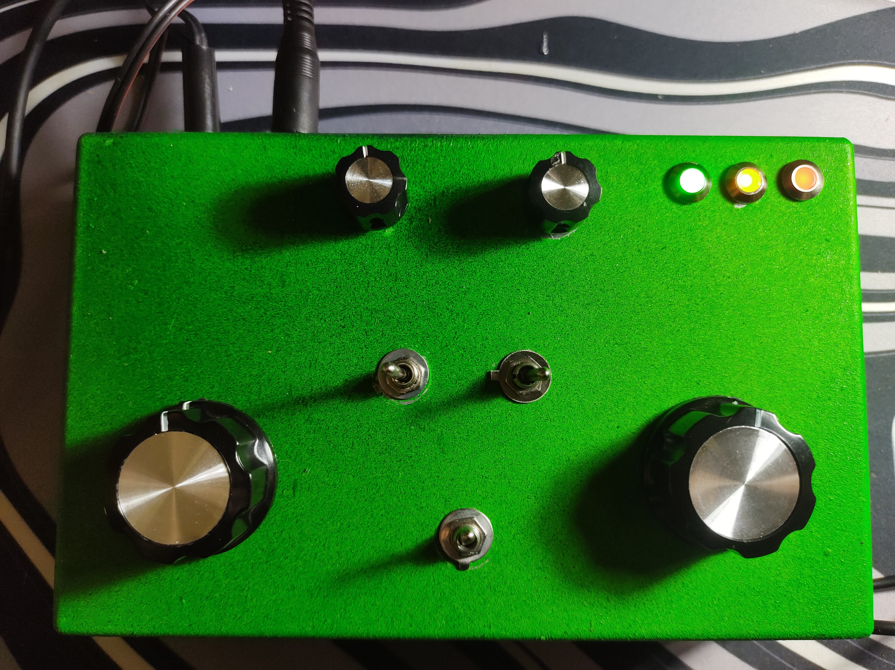
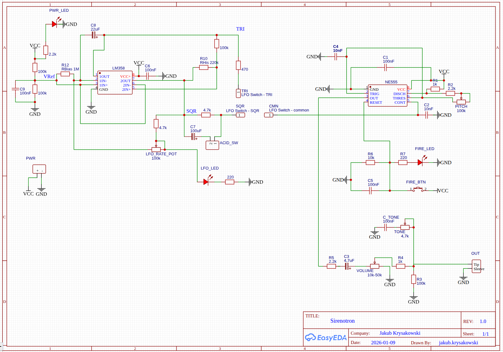
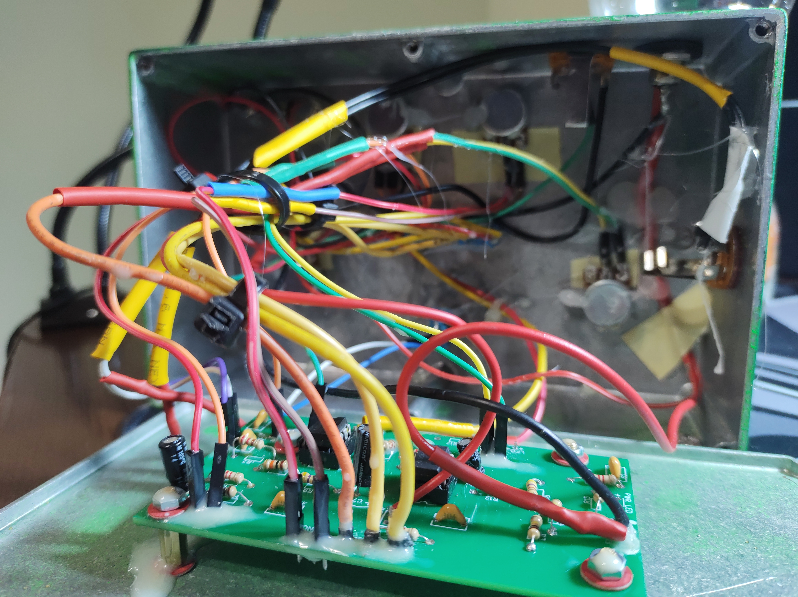
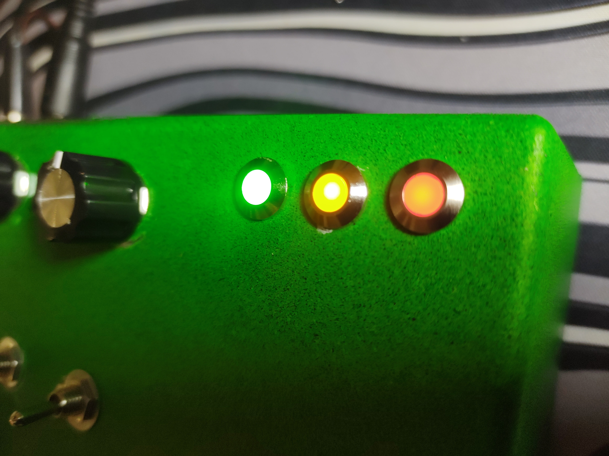
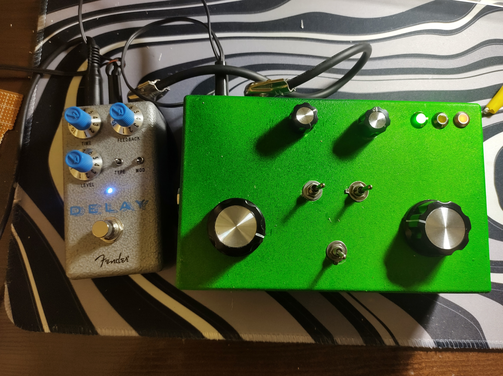
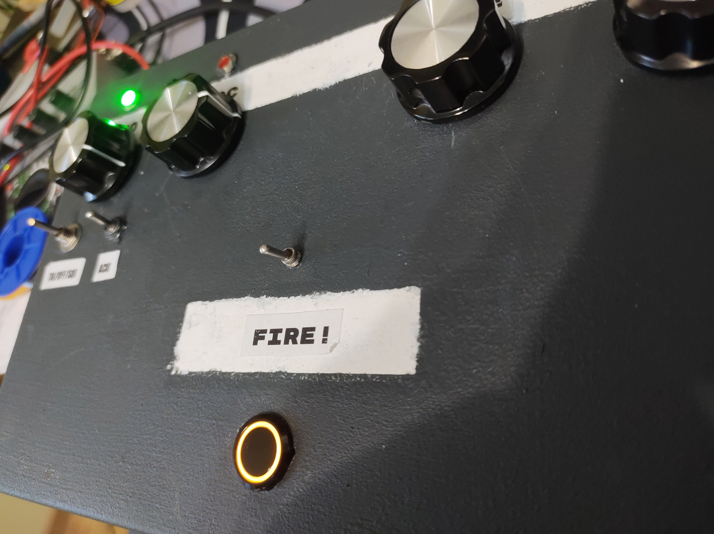

This is documentation for my electronic project, an analog siren synthesizer "Sirenotron".

I built it from scratch, designing it on paper, part by part, module by module, through multiple iterations of design, soldering, part replacement, voltage checks, and audio testing. Finally, the schematic looks like this:

Demo video:

The Sirenotron consists of a single square-wave oscillator based on the 555 timer and an LFO (low-frequency oscillator) based on an LM358. The LFO controls the pitch of the oscillator and has two modes: triangle and square. Additionally, there is a switch that enables Acid mode for the square-wave LFO. Technically, Acid mode is implemented by adding a single capacitor, but musically it gives a nice TB-303-like sound caused by voltage jumps on the edges of the square.

Controls:
- LFO speed
- LFO shape (triangle / off / square)
- Acid mode (off / on)
- Oscillator pitch
- Tone (simple low-pass filter)
- Volume
- "Fire!" button to trigger the sound

Connections:
- 9V DC Power input
- Main Output (Mono)
- External trigger input (e.g. footswitch)

LEDs:
- Power on - an LED built into the "Fire!" button
- LFO speed - green LED
- Sound activated by pressing "Fire!" - red LED

Power: 9V DC, center-negative polarity (minus on the tip).

Tips:

- If you notice too many digital-sounding highs, add a 10nF capacitor between the tip and sleeve of the output jack.
- If you want to kill more of the high harmonics, add 10-22nf from the point between R5 and C3 to ground.
- If you're having problems with the LFO LED, for example, if it's not flashing, connect it through a transistor. On the other hand, an LED connected without a transistor can cause interesting distortions in the LFO signal.
- Use CMOS 555! Instead of the classic NE555, use TLC555 - the difference in audio quality is huge.
- Replace the LFO capacitor (22uF) by something between 4.7 and 10 uF. With the 4.7uF you can talk to aliens on the high settings of the LFO speed.

Photo Gallery:

### Front

### Inside

### Leds

### It loves delays :)

### For the benefit of history - first prototype

